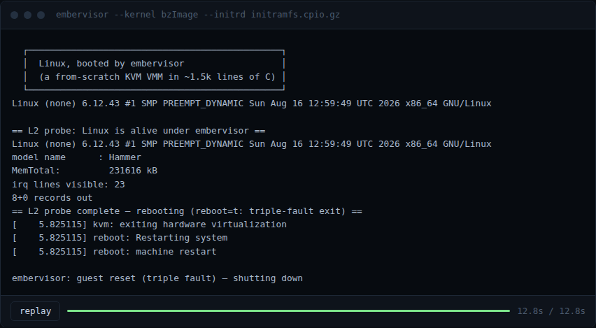

# embervisor

A virtual machine monitor written from scratch against the raw KVM API,
with no libvirt or QEMU underneath. About 1.5k lines of C. It boots a
stock Linux bzImage to an interactive busybox shell. The console is an
emulated 8250 UART; KVM's in-kernel irqchip delivers interrupts.

I wrote it to find out what actually sits between `/dev/kvm` and a
running guest. What state does a vCPU need before VMENTER will accept
it? What does the Linux boot protocol want from a loader? How much
device emulation does a kernel need before it hands you a shell? That
last one has a smaller answer than I expected: one UART.

```
$ ./embervisor --kernel bzImage --initrd initramfs.cpio.gz
...
[    0.610988] Run /init as init process

  ┌───────────────────────────────────────────────┐
  │  Linux, booted by embervisor                  │
  │  (a from-scratch KVM VMM in ~1.5k lines of C) │
  └───────────────────────────────────────────────┘
Linux (none) 6.12.43 #1 SMP PREEMPT_DYNAMIC x86_64 GNU/Linux

/ # echo hello from inside the VM
hello from inside the VM
```



The capture is an unedited run in the nested rig described below. Replay
it with `asciinema play docs/demo.cast`.

## Build and run

```sh
make                         # embervisor + the bare-metal test guest
./embervisor --flat guests/hello.bin        # smallest possible guest
./embervisor --kernel path/to/bzImage --initrd path/to/initramfs.cpio.gz
```

Needs `/dev/kvm`: bare-metal Linux with VT-x or AMD-V, or nested virt.
No virtualization hardware where you are? `scripts/run-nested.sh` builds
a self-contained rig that runs embervisor *inside* a TCG-emulated
machine. There's a section on it below.

`scripts/mkinitramfs.sh` builds a minimal busybox initramfs to boot
into. Console keys: `Ctrl-A x` quits, `Ctrl-A Ctrl-A` sends a literal
Ctrl-A. `^C` goes to the guest, where it belongs.

## How it works

KVM's userspace contract is small, and the code mirrors it:

1. `vm.c` sets the VM up. `/dev/kvm` is a factory: `KVM_CREATE_VM` hands
   back a VM fd. Guest RAM is one anonymous `mmap` in our own process,
   described to KVM through `KVM_SET_USER_MEMORY_REGION` as "guest
   physical 0 lives here". EPT/NPT does the rest at run time.
2. `vcpu.c` runs it. A vCPU is an fd plus an mmap'd `struct kvm_run`.
   `KVM_RUN` enters the guest and comes back only for things hardware
   can't settle alone: port I/O, MMIO to nothing, halt, triple fault.
   The `switch` on `run->exit_reason` *is* the VMM.
3. `loader.c` implements the x86 32-bit boot protocol
   (`Documentation/arch/x86/boot.rst`). Copy the protected-mode half of
   the bzImage to 1 MiB, hand-build the zero page (setup header, command
   line pointer, initrd location, an e820 map with the traditional 640K
   hole), then aim the vCPU at `0x100000` with `%esi` pointing at it.
   The real-mode setup blob in the bzImage never runs. We do its job
   instead.
4. `serial.c` is an 8250/16550A UART at `0x3f8`, IRQ 4. TX bytes go to
   stdout. A reader thread feeds stdin into the RX FIFO and pulses IRQ 4
   via `KVM_IRQ_LINE`, which is what makes the guest shell interactive:
   the guest's 8250 driver sleeps until the RX interrupt wakes it. It
   implements the divisor latch, loopback mode (the kernel's autoconfig
   probe uses it), and IIR arbitration, enough that Linux detects a
   16550A and trusts it with a console.

Two choices worth calling out:

- In-kernel irqchip (`KVM_CREATE_IRQCHIP` + `KVM_CREATE_PIT2`): PIC,
  IOAPIC, LAPIC and PIT all live in the kernel. Timer ticks never exit
  to userspace, and `HLT` parks the vCPU in-kernel until an interrupt is
  pending. Userspace's whole interrupt job is one ioctl when the UART
  has data.
- Skipping real mode: entering at the 32-bit protocol point means the
  segment state handed to `KVM_SET_SREGS` has to be architecturally
  valid on its own, or VMX refuses VMENTER. Flat 4G segments, a busy
  32-bit TSS in TR, `CR0.PE` set. What you get for it is no BIOS and no
  real-mode emulation, and the kernel's decompression stub takes over
  after a few hundred of our instructions.

Unknown port reads return all-ones and writes vanish, which is how an
empty ISA bus behaves. The kernel's probe-by-poking drivers (PCI, i8042,
secondary UARTs) conclude nothing is there and move on.

## The nested rig: testing a VMM with no virtualization hardware

I developed this inside a cloud container with no `/dev/kvm`. The
workaround became my favorite part of the project.
`scripts/run-nested.sh` boots our kernel as an L1 guest under pure TCG
QEMU (software emulation, no virt needed), with an emulated AMD CPU that
exposes SVM. L1's `kvm_amd` initializes happily against QEMU's SVM
emulation and offers a real `/dev/kvm`, so embervisor runs inside L1
unmodified: same ioctls, same exits, same code paths as bare metal.

```
L0  this machine        QEMU, TCG only, no virtualization hardware
L1  our kernel          sees "SVM", loads kvm_amd, exports /dev/kvm
L2  embervisor's guest  hello payload, or a full Linux boot
```

`run-nested.sh hello` finishes in seconds. `run-nested.sh linux` boots
Linux inside Linux with every L2 instruction interpreted, which takes
minutes, but it works, and watching it come up is oddly moving.

## Limitations

One vCPU, no SMP. No virtio, so no block or network devices. No ACPI, so
shutdown is `reboot=t` triple-faulting on purpose. 32-bit boot protocol
only: no EFI handover, no real-mode entry. The guest is a kernel and an
initramfs. I cut all of that deliberately rather than running into it,
and `docs/notes.md` records what each one would take to implement.

## Map

```
src/main.c      CLI and orchestration
src/vm.c        VM + memory + irqchip
src/vcpu.c      vCPU state, run loop
src/serial.c    8250 UART + stdin thread
src/loader.c    flat + bzImage/boot protocol
guests/hello.S  16-bit bare-metal test guest
docs/notes.md   the long-form writeup
```

MIT licensed. Built and tested against Linux 6.12.x guests.
